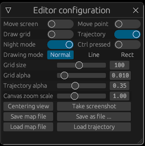
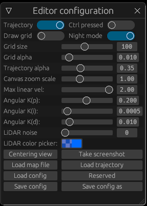

# LSMv2
**L**iDAR **S**i**M**ulator v2: Interactive 2D LiDAR scanner simulator version II. Implemented via Rust and CUDA.
## Functionalities & Features

- Simulated 2D scanner data. The simulation algorithm is written in CUDA (fast ray trace algorithm being able to simulated a scan with 2400 points within 0.5ms).
- Visualization via Rust [nannou](https://github.com/nannou-org/nannou) (implemented in OpenGL), enabling smooth and limitless visualization.
  - For example, the older simulation visualization implemented in OpenCV is restricted to pixel plotting: unable (or very tricky) to zoom in\out, rotate and translate the canvas.
  - Nannou has no limits w.r.t canvas operations and it is extremely efficient due to the bottom layer implementation of OpenGL.
  - `nannou_egui` crate used. Intergrated Rust EGUI GUI implementation, easy to use & good looking.

|     GUI for editor     |                  GUI for simulator                   |
| :--------------------: | :--------------------------------------------------: |
|  |  |

- Smooth mouse & keyboard control of the simulated scanner (via nannou API).
- Mixed programing: Rust & CUDA C++: Enabling accelerated 2d LiDAR ray trace.
- Fast collision detection: scanner will not be allowed to drive into the obstacles
  - Coarse occupancy grid (indicates the obstacle id of the grid if the grid is occupied)
  - Use the id to access the contour of the obstacle and check whether the scanner is going to move inside the obstacle (point in polygon test)
  - An efficient algorithm implemented via Rust
- Better map editor (than version I, the old LiDARSim2D)
    - Canvas translation, rotation and scaling are supported.
    - Three modes: polygon, straight line (axis-aligned), rectangle (axis-aligned)
    - Drawn point selection, movement, deletion.
    - Easy to edit the previously drawn map. Trajectory display.
    - Screen shot API (also available in simulator)
- Rust implementation: Safer, clearer and efficiency guaranteed! (Personally, I prefer Rust than C++)
- configuration parser: modify the configurations of LiDAR, map, etc. in a `.json` file without compiling!

## TODO

- [ ] Dynamic obstacle simulation:
  - [ ] Trajectory and pose planning for one or multiple automatic mobile agents. (Like simulate pedestrians wandering in the map)
  - [ ] Dynamic obstacle ray trace (a few additions in my current CUDA ray tracer)
  - [ ] Interactable dynamic objects (doors, mainly)
- [ ] Automation & Editability
  - [ ] Trajectory recorder for semi-automatic simulation
  - [ ] Trajectory and pose planning for scanner --- fully automatic simulation
  - [ ] (On going) Better map editor and visualizer
- [ ] ROS API
  - [ ] Connect to ROS (I don't know how to do this, yet), send simulated `sensor_msgs/LaserScan` to rviz
  - [ ] More available sensors like Odometry and IMU
- [ ] Fancier Future
  - [ ] Network API: multiple scanners.
  - [ ] Visualizer. Replacing RViz!

## Simple Demo

https://user-images.githubusercontent.com/46109954/170672124-9a9eadaa-960b-4210-a8c2-ce416d11fc21.mp4

## Compile & Run
CUDA and `rustc` are of course, mandatory dependencies. `arch=compute_86` is recommended, since its usability is verified. For lower versions, please modify `lsm/build.rs`:
```rust
...
.flag("-gencode")
.flag("arch=compute_86,code=sm_86")
```

Once you have the correct CUDA (and nvidia driver) and Rust Env, compilation should be smooth (if the source of Rust is correctly set). For (us) Chinese users, the source of rust libs should be changed to some faster domestic mirror sources, otherwise... wait for 10 years and the compilation might complete.

Currently, there is only one usable executable file in this repo:
```shell
cd lsm
cargo build --release
cargo run --release --bin=sim
```
And there u go, a screen pops up and after setting the initial pose (left button, long press), you will see the simulated stuffs...
